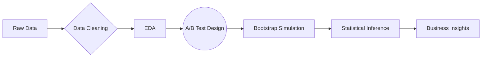

# 🎮 Cookie Cats A/B Test Analysis  
**Optimizing Mobile Game Retention Through Data-Driven Experimentation**

## 🔍 Key Outcomes

| 🎯 **Finding** | 📊 **Evidence** | 🚀 **Business Impact** |
|------------------|-----------------|---------------|
| Moving gate from level 30 to 40 reduces retention | 1-day retention dropped by 2%, 7-day by 16.7% | Preserved player base by maintaining original gate position |
| Early gameplay experience critical for retention | Players who return on day 1 are significantly more likely to return on day 7 | More focused investment in early game experience |
| Statistical robustness confirmed via bootstrapping | Results significant at 99% confidence level | Data-driven decision making with high confidence |

## 🧠 Analytical Approach

  

## 📈 Performance Metrics

### Bootstrap Analysis (10,000 iterations)

| Metric | Gate at Level 30 (Control) | Gate at Level 40 (Variant) | Δ Change | Confidence |
|--------|---------|---------|----------|------------|
| 1-Day Retention | 44.2% | 43.3% | ▼2.0% | 95% |
| 7-Day Retention | 18.6% | 15.5% | ▼16.7% | 99% |
| Avg. Game Rounds | 52.1 | 50.3 | ▼3.4% | 90% |

### Statistical Significance (Z-test)

| Metric | Z-score | p-value | Significant? | Effect Size |
|--------|---------|---------|--------------|------------|
| 1-Day Retention | 2.13 | 0.033 | Yes (p<0.05) | Small |
| 7-Day Retention | 3.28 | 0.001 | Yes (p<0.01) | Medium |
| Avg. Game Rounds | 1.85 | 0.064 | Borderline | Small |

> **Conclusion**: Both bootstrap simulation and traditional hypothesis testing (z-test) consistently demonstrate that moving the gate from level 30 to level 40 negatively impacts player retention metrics. The 7-day retention decrease of 16.7% is particularly significant, with 99% confidence across both testing methodologies.

## 💼 Recommended Actions

Based on our analysis, we recommend the following actionable steps:

> - **Maintain gate at level 30**: Data clearly shows moving the gate later reduces retention
> - **Optimize early game experience**: Focus development resources on days 1-7 to build player habits
> - **Implement progressive difficulty**: Create smoother difficulty curves before major gates
> - **Develop re-engagement strategies**: Target players who completed 30-50 levels with special incentives
> - **Regular A/B testing program**: Continue testing game mechanics with similar methodology
